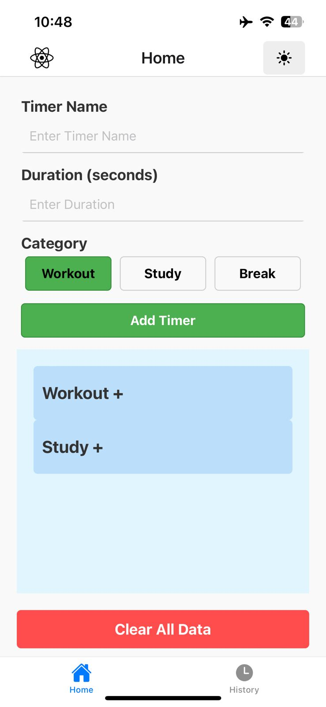
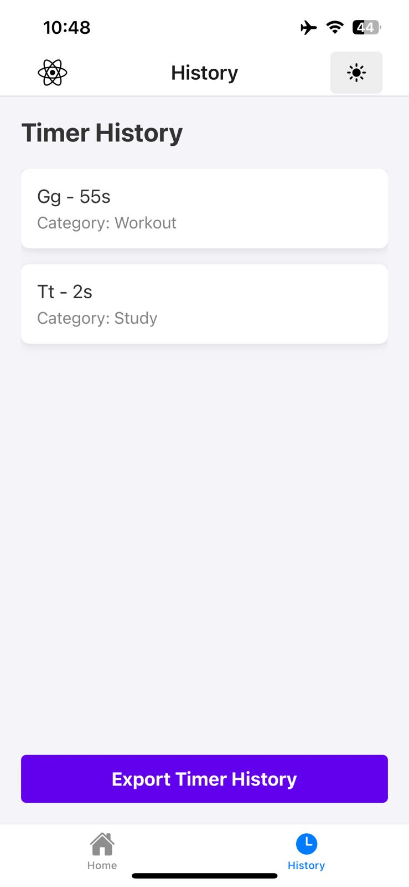

# Timer App 

A React Native app to manage workout timers with categories, progress tracking, and history export functionality. The app supports dark mode and uses `AsyncStorage` for persistent data storage.

---

## Features ✨

- **Create Timers**: Add timers with a name, duration, and category (e.g., Workout, Study, Break).
- **Timer Management**: Start, pause, reset, and track progress for individual timers or entire categories.
- **Dark Mode**: Toggle between light and dark themes for better visibility.
- **History Export**: Export your timer history as a JSON file.
- **Progress Bar**: Visualize timer progress with a dynamic progress bar.
- **Category Management**: Group timers by categories and manage them collectively (start all, pause all, reset all).
- **Completion Modal**: Get a congratulatory message when a timer completes.

---

## Screenshots 📸

| Home Screen | History Screen |
|-------------|----------------|
|  |  |

---


## Installation 🛠️

1. **Clone the repository**:
   ```bash
   git clone https://github.com/jeevannn0/Timer-Application
   cd workout-timer-app
   ```

2. **Install Dependencies**:
   ```bash
   npm install
   ```

3. **Install Expo Go** (for testing on a mobile device):
   - Download [Expo Go](https://expo.dev/client) from the App Store (iOS) or Google Play Store (Android).

4. **Start the development server**:
   ```bash
   npx expo start
   ```

5. **Run the App on Mobile**:
   - Open Expo Go on your mobile device.
   - Scan the QR code displayed in your terminal or browser.
   - The app will launch on your device.

---

## Run the App on Emulator/Simulator

### For iOS:
```bash
npx react-native run-ios
```

### For Android:
```bash
npx react-native run-android
```

## Usage 🚀

### Add a Timer:
- Go to the "Home" tab.
- Fill in the timer name, duration, and category.
- Click "Add Timer".

### Manage Timers:
- Start, pause, or reset individual timers.
- Use the category headers to start, pause, or reset all timers in a category.

### Export History:
- Go to the "History" tab.
- Click "Export Timer History" to save your timer history as a JSON file.

### Toggle Dark Mode:
- Click the sun/moon icon in the top-right corner to toggle between light and dark themes.

## Dependencies 📦
- `@react-native-async-storage/async-storage`: For persistent data storage.
- `@react-navigation/bottom-tabs`: For bottom tab navigation.
- `@react-navigation/native`: For navigation support.
- `react-native-vector-icons`: For icons in the app.
- `expo-file-system`: For exporting timer history.
- `react-native-progress`: For progress bar visualization.

## Code Structure 🗂️
- `App.js`: Main entry point with navigation setup and dark mode toggle.
- `HomeScreen.js`: Main screen for adding and managing timers.
- `TimerForm.js`: Form component for adding new timers.
- `TimerList.js`: Component to display and manage timers.
- `HistoryScreen.js`: Screen to view and export timer history.